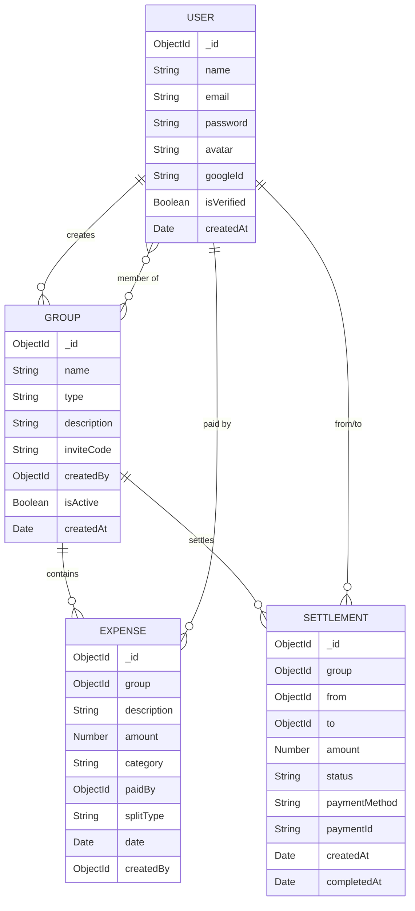

# 💸 SplitSmart

A full-stack expense management and settlement platform with optimized debt calculation, real-time balance tracking, and detailed financial analytics.

<div align="center">

| Node.js | Express | React | MongoDB | Tailwind CSS |
| :---: | :---: | :---: | :---: | :---: |
| 18+ | 5.x | 19 | 7+ | 4.x |

**Hackathon / Project Showcase 2026**

[Features](#-key-features) • [Architecture](#-architecture) • [Tech Stack](#-tech-stack) • [Quick Start](#-quick-start) • [Project Structure](#-project-structure) • [API Reference](#-api-reference) • [Database](#-database-schema) • [Algorithm](#-min-cash-flow-algorithm) • [Security](#-security)

</div>

---

## 🚀 Key Features

### 💰 Expense Management
- Create groups (**Travel**, **Hostel**, **Event**, **Custom**) and invite members via join codes
- Add expenses with **equal**, **percentage**, or **custom exact** splits
- Real-time balance tracking with pairwise debt visualization
- **Min-cash-flow algorithm** — minimizes the number of transactions needed to settle all debts

### 💳 Payments & Settlement
- **Razorpay integration** for in-app payments (UPI, cards, net banking)
- Settlement creation, tracking, and confirmation workflow
- Supports multiple payment methods: `razorpay`, `upi`, `cash`, `bank_transfer`, `other`

### 📊 Analytics & Reporting
- Category-wise spending breakdown (pie charts)
- Monthly spending trends (bar charts)
- Member contribution analysis
- Debt graph visualization with numbered nodes
- Export group ledger as **CSV**

### 🔒 Authentication & Security
- Email/password signup with email verification
- **Google OAuth2** login
- Password reset flow with secure tokens
- JWT-based session management with auto-refresh

### 📧 Smart Notifications
- **HTML-styled** email templates (verification, welcome, settlement confirmation)
- Password reset emails with expiring secure links
- Settlement notification alerts

### 🧾 Receipt Scanner
- Upload a receipt image → auto-extracts description, amount, and category
- Supports JPEG, PNG, WebP, and HEIC formats
- 10 MB max file size with server-side validation

---

## 🏗 Architecture

```
┌──────────────────────────────────────────────────────────────────┐
│                         CLIENT (React SPA)                       │
│  React 19 • Vite • Tailwind CSS v4 • Recharts • Glassmorphism   │
│                                                                  │
│   AuthContext ──► Axios Interceptors ──► Protected Routes        │
│        │              │ (auto token refresh)                     │
│        ▼              ▼                                          │
│   Login/Signup    Dashboard ──► Groups ──► [Expenses, Balances,  │
│   (Google OAuth)                            Settlements,         │
│                                             Analytics]           │
└────────────────────────┬─────────────────────────────────────────┘
                         │  REST API  (JWT Bearer)
                         ▼
┌──────────────────────────────────────────────────────────────────┐
│                       SERVER (Express.js)                        │
│  Node.js • Express 5 • Joi Validation • Multer                  │
│                                                                  │
│   Auth ──► Groups ──► Expenses ──► Balances ──► Settlements     │
│    │                                   │                         │
│    ▼                                   ▼                         │
│  Google OAuth               Min-Cash-Flow Algorithm              │
│  JWT + Refresh              (Greedy O(n log n) optimizer)        │
│                                                                  │
│   Payments (Razorpay)    Analytics (Aggregation Pipelines)       │
│   Receipt Scanner        Email Service (Nodemailer + SMTP)       │
│   CSV Export             Error Handling Middleware                │
└────────────────────────┬─────────────────────────────────────────┘
                         │
                         ▼
┌──────────────────────────────────────────────────────────────────┐
│                      DATABASE (MongoDB)                          │
│                                                                  │
│   Users ──── Groups ──── Expenses ──── Settlements               │
│   (bcrypt)  (inviteCode) (splits[])    (status workflow)         │
│   (googleId) (members[])  (pre-save     (pending → completed     │
│              (roles)       validation)    → rejected)            │
└──────────────────────────────────────────────────────────────────┘
```

### User Flow

```
Sign Up / Login
      │
      ├── New User? ──Yes──► Email Verification
      │No                          │
      └────────────────────────────┘
                   ▼
               Dashboard
                   │
                   ▼
          Create or Join Group
                   │
                   ▼
              Add Expense
                   │
                   ▼
            Has Receipt?
           /             \
         Yes               No
          │                 │
    Upload Receipt      Manual Entry
    (AI Auto-Extract)
           \               /
            ▼             ▼
          Choose Split Method
                   │
                   ▼
          View Balances & Debts
         /          |          \
        ▼           ▼           ▼
  Get Settlement  View       Export
   Suggestions  Analytics     CSV
        │
        ▼
  Pay via Razorpay
        │
        ▼
  Settlement Confirmed
        │
        ▼
  Email Notification Sent
```

---

## 💻 Tech Stack

| Layer | Technology | Purpose |
| :--- | :--- | :--- |
| **Backend** | Node.js, Express.js 5, Joi | REST API, business logic, request validation |
| **Frontend** | React 19, Vite, Tailwind CSS v4, Recharts | SPA with responsive UI, interactive data charting |
| **Database** | MongoDB, Mongoose | Persistent NoSQL data storage, schema modeling |
| **Auth** | JWT, bcrypt.js, Google OAuth2 | Stateless authentication, password cryptography |
| **Payments** | Razorpay Payment Gateway | UPI, cards, net banking |
| **Email** | Nodemailer (SMTP) | Transactional emails & notifications |
| **File Upload** | Multer | Receipt image uploads with validation |
| **Validation** | Joi | Server-side request schema validation |

---

## ⚙️ Quick Start

### Prerequisites

| Tool | Version | Install |
| :--- | :--- | :--- |
| **Node.js** | 18+ | [nodejs.org](https://nodejs.org) |
| **MongoDB** | 7+ | [mongodb.com](https://www.mongodb.com/try/download) |
| **Git** | Latest | [git-scm.com](https://git-scm.com) |

---

### 1. Clone the Repository

```bash
git clone https://github.com/<your-username>/SplitSmart.git
cd SplitSmart
```

### 2. Configure Environment Variables

Create a `.env` file in the project root:

```env
PORT=5000
MONGO_URI=mongodb://localhost:27017/splitsmart
JWT_SECRET=your_jwt_secret_key
JWT_REFRESH_SECRET=your_jwt_refresh_secret
CLIENT_URL=http://localhost:5173

# Email (Nodemailer)
EMAIL_HOST=smtp.ethereal.email
EMAIL_PORT=587
EMAIL_USER=
EMAIL_PASS=

# Razorpay
RAZORPAY_KEY_ID=
RAZORPAY_SECRET=

# Google OAuth
GOOGLE_CLIENT_ID=

NODE_ENV=development
```

> [!TIP]
> **Google OAuth:** Obtain a Client ID from [Google Cloud Console](https://console.cloud.google.com/). Add `http://localhost:5173` as an authorized JavaScript origin.

> [!TIP]
> **Email in Development:** Works out-of-the-box using [Ethereal](https://ethereal.email/) test accounts — no real SMTP credentials needed. Preview URLs are logged to the console.

---

### 3. Install Dependencies & Seed Demo Data

```bash
# Backend
cd server
npm install
node seed.js          # Seeds 5 demo users, 3 groups, 18 expenses

# Frontend (open a new terminal)
cd client
npm install
```

### 4. Start Development Servers

```bash
# Terminal 1 — Backend
cd server
npm run dev            # http://localhost:5000

# Terminal 2 — Frontend
cd client
npm run dev            # http://localhost:5173
```

| Service | URL |
| :--- | :--- |
| Frontend | `http://localhost:5173` |
| Backend API | `http://localhost:5000/api` |
| Health Check | `http://localhost:5000/api/health` |

---

### 5. Demo Credentials

| User | Email | Password |
| :--- | :--- | :--- |
| Amit Kumar | `amit@demo.com` | `demo123` |
| Priya Sharma | `priya@demo.com` | `demo123` |
| Rahul Verma | `rahul@demo.com` | `demo123` |

---

## 📂 Project Structure

```
SplitSmart/
├── client/                              # React + Vite SPA
│   ├── src/
│   │   ├── components/
│   │   │   ├── balances/                # Balance summary & pairwise views
│   │   │   ├── charts/                  # Recharts pie/bar chart wrappers
│   │   │   ├── expenses/                # Expense list & add expense modal
│   │   │   ├── groups/                  # Group cards & join/create modals
│   │   │   ├── layout/                  # Navbar & page layout
│   │   │   ├── settlements/             # Settlement suggestions & history
│   │   │   └── ui/                      # Shared UI primitives
│   │   ├── context/
│   │   │   └── AuthContext.jsx          # Global auth state + Google OAuth
│   │   ├── pages/
│   │   │   ├── Dashboard.jsx            # Overview with stats & quick actions
│   │   │   ├── Groups.jsx               # Group listing & management
│   │   │   ├── GroupDetail.jsx          # Expenses, Balances, Settlements, Analytics
│   │   │   ├── Login.jsx                # Email + Google login
│   │   │   └── Signup.jsx               # Email + Google signup
│   │   ├── services/
│   │   │   └── api.js                   # Axios instance with interceptors
│   │   ├── index.css                    # Global glassmorphism & Tailwind utilities
│   │   └── main.jsx                     # App entry with GoogleOAuthProvider
│   ├── index.html
│   ├── vite.config.js
│   └── package.json
│
├── server/                              # Express.js REST API
│   ├── config/
│   │   └── db.js                        # MongoDB connection handler
│   ├── controllers/
│   │   ├── authController.js            # Signup, Login, Google OAuth, JWT refresh
│   │   ├── groupController.js           # CRUD groups, join via invite code
│   │   ├── expenseController.js         # CRUD expenses with split calculation
│   │   ├── balanceController.js         # Net balances, pairwise debts, graph data
│   │   ├── settlementController.js      # Create & manage settlements
│   │   ├── analyticsController.js       # Category, monthly, member analytics + CSV
│   │   ├── paymentController.js         # Razorpay order creation & verification
│   │   └── receiptController.js         # Receipt image upload & parsing
│   ├── middleware/
│   │   ├── auth.js                      # JWT protection + group membership check
│   │   ├── validate.js                  # Joi schema validation middleware
│   │   └── errorHandler.js              # Centralized error formatting
│   ├── models/
│   │   ├── User.js                      # User schema with bcrypt & Google ID
│   │   ├── Group.js                     # Group with members, roles, invite codes
│   │   ├── Expense.js                   # Expense with splits & pre-save validation
│   │   └── Settlement.js                # Settlement with status workflow
│   ├── routes/
│   │   ├── authRoutes.js                # /api/auth/*
│   │   ├── groupRoutes.js               # /api/groups/*
│   │   ├── expenseRoutes.js             # /api/groups/:id/expenses/*
│   │   ├── balanceRoutes.js             # /api/groups/:id/balances/*
│   │   ├── settlementRoutes.js          # /api/groups/:id/settlements/*
│   │   ├── analyticsRoutes.js           # /api/groups/:id/analytics/*
│   │   ├── exportRoutes.js              # /api/groups/:id/export/*
│   │   ├── paymentRoutes.js             # /api/payments/*
│   │   └── receiptRoutes.js             # /api/receipts/*
│   ├── services/
│   │   ├── emailService.js              # Nodemailer with HTML templates
│   │   └── settlementService.js         # Min-Cash-Flow algorithm engine
│   ├── seed.js                          # Demo data generator
│   ├── server.js                        # App bootstrap & middleware setup
│   └── package.json
│
├── docs/
│   └── screenshots/                     # Product screenshots for README
├── .env                                 # Environment variables (git-ignored)
└── README.md
```

---

## 📡 API Reference

All endpoints are prefixed with `/api`. Protected routes require a `Bearer` token in the `Authorization` header.

<details>
<summary><strong>🔐 Auth</strong></summary>

| Method | Endpoint | Description | Auth |
| :--- | :--- | :--- | :---: |
| `POST` | `/auth/signup` | Register a new user | ✗ |
| `POST` | `/auth/login` | Login with email/password | ✗ |
| `POST` | `/auth/google` | Login/register with Google OAuth | ✗ |
| `GET` | `/auth/verify-email` | Verify email via token | ✗ |
| `POST` | `/auth/forgot-password` | Request password reset email | ✗ |
| `POST` | `/auth/reset-password` | Reset password with token | ✗ |
| `POST` | `/auth/refresh-token` | Refresh expired access token | ✗ |
| `GET` | `/auth/profile` | Get current user profile | ✓ |

</details>

<details>
<summary><strong>👥 Groups</strong></summary>

| Method | Endpoint | Description | Auth |
| :--- | :--- | :--- | :---: |
| `POST` | `/groups` | Create a new group | ✓ |
| `GET` | `/groups` | List all user's groups | ✓ |
| `POST` | `/groups/join` | Join group via invite code | ✓ |
| `GET` | `/groups/:id` | Get group details | ✓ |
| `PUT` | `/groups/:id` | Update group info | ✓ |
| `DELETE` | `/groups/:id` | Delete a group | ✓ |
| `GET` | `/groups/:id/members` | List group members | ✓ |

</details>

<details>
<summary><strong>💸 Expenses</strong></summary>

| Method | Endpoint | Description | Auth |
| :--- | :--- | :--- | :---: |
| `POST` | `/groups/:id/expenses` | Add a new expense | ✓ |
| `GET` | `/groups/:id/expenses` | List group expenses | ✓ |
| `PUT` | `/groups/:id/expenses/:eid` | Update an expense | ✓ |
| `DELETE` | `/groups/:id/expenses/:eid` | Delete an expense | ✓ |

</details>

<details>
<summary><strong>⚖️ Balances & Settlements</strong></summary>

| Method | Endpoint | Description | Auth |
| :--- | :--- | :--- | :---: |
| `GET` | `/groups/:id/balances/summary` | Net balance for each member | ✓ |
| `GET` | `/groups/:id/balances/pairwise` | Pairwise debt breakdown | ✓ |
| `GET` | `/groups/:id/balances/graph` | Graph data (nodes + edges) | ✓ |
| `GET` | `/groups/:id/settlements/suggestions` | Min-cash-flow optimized suggestions | ✓ |
| `POST` | `/groups/:id/settlements` | Record a new settlement | ✓ |
| `GET` | `/groups/:id/settlements` | List all settlements | ✓ |
| `PUT` | `/groups/:id/settlements/:sid` | Update settlement status | ✓ |

</details>

<details>
<summary><strong>💳 Payments</strong></summary>

| Method | Endpoint | Description | Auth |
| :--- | :--- | :--- | :---: |
| `POST` | `/payments/create-order` | Create Razorpay order | ✓ |
| `POST` | `/payments/verify` | Verify Razorpay payment | ✓ |

</details>

<details>
<summary><strong>🧾 Receipt Scanner</strong></summary>

| Method | Endpoint | Description | Auth |
| :--- | :--- | :--- | :---: |
| `POST` | `/receipts/scan` | Upload & parse receipt image | ✓ |

> Accepts `multipart/form-data` with a `receipt` field. Supported formats: **JPEG, PNG, WebP, HEIC**. Max size: **10 MB**.

</details>

<details>
<summary><strong>📊 Analytics & Export</strong></summary>

| Method | Endpoint | Description | Auth |
| :--- | :--- | :--- | :---: |
| `GET` | `/groups/:id/analytics/category` | Category-wise spending breakdown | ✓ |
| `GET` | `/groups/:id/analytics/monthly` | Monthly spending trends | ✓ |
| `GET` | `/groups/:id/analytics/members` | Member contribution percentages | ✓ |
| `GET` | `/groups/:id/export/csv` | Download group ledger as CSV | ✓ |

</details>

---

## 🗄 Database Schema



### Key Relationships

| Relation | Type | Description |
| :--- | :--- | :--- |
| User → Group | One-to-Many | A user can create multiple groups |
| Group → Members | Many-to-Many | Groups have multiple members with roles (`admin` / `member`) |
| Group → Expense | One-to-Many | Each group has multiple expenses |
| Expense → Splits | Embedded Array | Each expense contains split amounts per user |
| Group → Settlement | One-to-Many | Settlements track debt repayments between members |

### Data Integrity

- **Expense pre-save hook** — validates that split amounts sum to the total expense amount (tolerance: ₹0.01)
- **Password hashing** — bcrypt with 12 salt rounds on every `User.save()`
- **Invite codes** — auto-generated UUID v4 short codes, unique per group

---

## 🔐 Min-Cash-Flow Algorithm

The settlement optimization engine uses a **greedy algorithm** to minimize the total number of transactions required to settle all debts within a group.

```
Complexity: O(n log n) — dominated by sorting step

Steps:
1. Calculate net balance for each member (credits − debits)
2. Separate into creditors (+balance) and debtors (−balance)
3. Sort both lists by amount (descending)
4. Greedy match: pair largest debtor with largest creditor
5. Settle the minimum of the two amounts
6. Repeat until all balances reach zero
```

**Example:**

| Before Optimization | After Optimization |
| :--- | :--- |
| A → B: ₹500 | A → C: ₹300 |
| A → C: ₹300 | B → C: ₹200 |
| B → C: ₹200 | |
| B → A: ₹500 | **2 transactions saved** |

By greedily pairing the largest outstanding debts with the largest outstanding credits, the algorithm converges to a minimal transaction set — producing the optimal solution for most real-world group sizes.

---

## 🛡 Security

| Concern | Implementation |
| :--- | :--- |
| **Authentication** | JWT access tokens (1d) + refresh tokens (7d) + Google OAuth2 |
| **Password Storage** | bcrypt hashing with 12 salt rounds — plaintext never stored |
| **API Protection** | Express middleware intercepting missing or tampered tokens |
| **Group Authorization** | `groupMember` middleware verifying membership before any data access |
| **Input Validation** | Joi schemas on all mutating endpoints (signup, login, expenses, settlements) |
| **Data Integrity** | Mongoose pre-save hooks rejecting mathematically invalid expense splits |
| **Token Refresh** | Transparent Axios interceptors auto-refreshing expired access tokens |
| **Email Tokens** | Cryptographically random, single-use, time-expiring (24h verify / 1h reset) |
| **CORS** | Whitelisted origins only (`CLIENT_URL` environment variable) |
| **File Uploads** | MIME type filtering + 10 MB size limits enforced via Multer |

---

## 🤝 Contributing

1. Fork the repository
2. Create a feature branch: `git checkout -b feature/amazing-feature`
3. Commit your changes: `git commit -m 'Add amazing feature'`
4. Push to the branch: `git push origin feature/amazing-feature`
5. Open a Pull Request

---

## 📄 License

This project is open source and available under the [MIT License](LICENSE).

---

<div align="center">

Built with 💜 using Node.js, Express, React & MongoDB

*If you found this helpful, consider giving it a ⭐*

</div>
